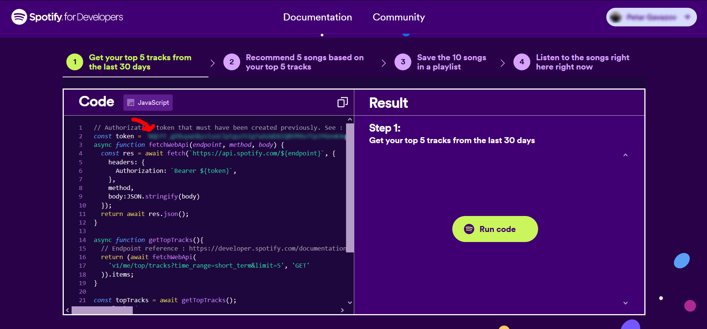
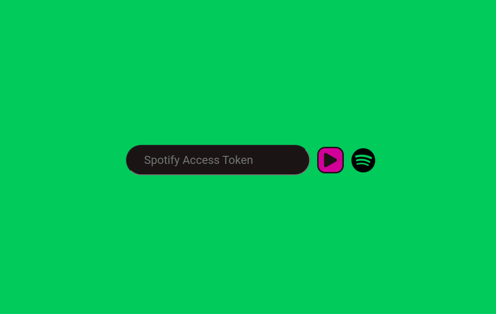

###### a minimalistic app that showcases your most listened monthly Spotify tracks

## How to use:
### 🆕 Connect with Spotify flow:

1. Click on the spotify icon.

2. Connect with your spotify account.

 All done. If you decide to logout, simply press the "❌" in the top right corner.

### 🗝️ Login using an access token flow:

1. Obtain an access token by logging in https://developer.spotify.com and copying your token.

2. Use your access token inside the app.

You're all done, <i>enjoy</i>
